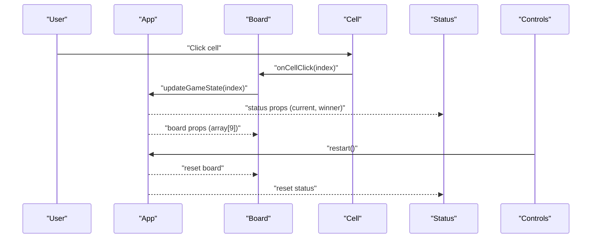

# Tic Tac Toe Frontend - Architecture Overview

## Overview
This document describes the architecture of the tic_tac_toe_frontend React application. The app is a single-page application designed to run entirely in the browser, rendering a Tic Tac Toe board and managing game state locally. It currently uses a lightweight template with a theme toggle and minimal dependencies.

## System Context
- Client-only React application (no backend in current scope).
- Stateless across sessions (no persistence).
- Future-ready stubs for GxP compliance artifacts (audit and access controls) to be extended if a backend is introduced.

## Component Design
### App Component (src/App.js)
- Responsibilities:
  - Hosts overall layout and theme toggle.
  - In the target design, composes child components: Board, Cell, Status, and Controls.
- Current State:
  - Manages theme state (light/dark).
  - Renders a logo and a theme toggle button.
- Planned Extensions (for gameplay):
  - Board component rendering a 3x3 grid of Cell components.
  - Status component displaying current player or game outcome.
  - Controls component providing a restart button.

### Styling
- CSS via src/App.css with theme variables and responsive adjustments.
- Theme toggled by setting data-theme attribute on document root.
- Ocean Professional theme:
  - Primary: #2563EB
  - Secondary: #F59E0B
  - Error: #EF4444
  - Background: #f9fafb
  - Surface: #ffffff
  - Text: #111827

## Data Flow and State Management
- State Scope:
  - Theme: string "light" | "dark".
  - Game State (planned): board array of 9 cells, current player, winner/draw flags.
- Data Flow:
  - User clicks a cell → dispatches a state update → UI re-renders → status updates.
  - Restart button resets board and state to initial values.
- React Paradigm:
  - Functional components with useState/useEffect.
  - Derive display state from source of truth (board array).
  - Keep game logic pure and easily testable.

## Error Handling
- UI Safety:
  - Prevent illegal moves (ignore clicks on occupied cells or game-over state).
- Error Surface:
  - Provide user-friendly messages where needed (e.g., disabled controls).
- Technical Logging:
  - In the absence of backend: console.error for unexpected conditions.
  - Future: structured log events sent to server for audit.

## Access Controls (Stubbed for future)
- Current: Single-user with no authentication.
- Future Plan:
  - Introduce authentication context that provides user identity and roles.
  - Role-based access control checks for sensitive operations.
  - Protect administrative controls if introduced.

## Audit Trail Approach (Frontend-Side Stubs)
- Current Scope:
  - Audit trail is a stub with no persistence; actions may be logged in memory or console during development.
  - For each state-changing action (move, restart): capture timestamp, action type, pre/post state snapshot.
- Future Scope:
  - Transmit structured audit logs to a backend service that enforces ALCOA+ with persistent storage.
  - Bind logs to authenticated user identity to ensure attribution and non-repudiation.

## Validation Controls
- Input Validation:
  - Validate cell clicks: ensure indices 0–8 only, only if cell empty, only if game not finished.
- Business Rules:
  - Alternate turns X → O → X.
  - Detect wins and draws accurately.
- Cross-Field Validation:
  - Board consistency: marks must align with number of turns taken.

## Performance and Rendering
- Efficient Updates:
  - Use immutable updates for board changes to enable fast re-render.
  - Avoid unnecessary re-renders by scoping state to closest components.
- Complexity:
  - Constant-time checks for clicks; O(1) per move with simple win checks.

## Testing Strategy (Summary)
- Unit Tests:
  - Core game logic (move validation, win/draw detection).
  - Component rendering and interaction (clicks update state).
- Integration (where applicable):
  - Component composition behavior: Board + Status + Controls.
- Validation Tests (GxP focus):
  - Requirements traceability: tests mapped to REQ IDs.
  - Data integrity behaviors (no illegal moves, deterministic outcomes).
- Performance Tests:
  - Simple render benchmarks; ensure no noticeable lag.

## Deployment Considerations
- Build with react-scripts; app served as static files.
- No environment configuration required (current scope).

## Mermaid Diagram: Component Interaction

## GxP Alignment Overview
- ALCOA+ stubs integrated at frontend level, with clear plan to move to server-backed audit in future.
- Validation controls embedded in UI logic; tests verifiable and mapped to requirements.
- Access controls planned with user identities for any future features requiring attribution.

## References
- Source files:
  - src/App.js
  - src/App.css
  - src/index.js
  - src/App.test.js
